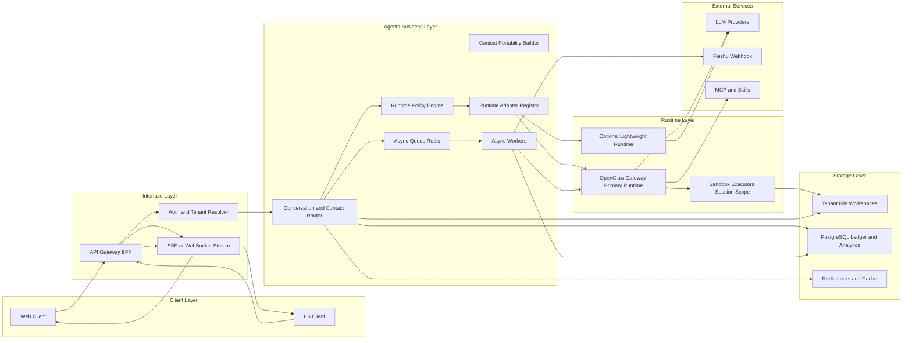

# FriendsAI Agent First Architecture

## Problem and Goal

FriendsAI is rebuilding a traditional relationship-management product as an **agent-first system**.
The product needs to support long-lived, per-user butler behavior while remaining operationally efficient.

Primary goal:

- Keep one shared control plane for cost and operations.
- Keep user data, memory, and execution context isolated.
- Keep runtime choice flexible so the agent layer can evolve.

## Role Model

FriendsAI uses three core roles:

- **User**: the FriendsAI customer and data owner.
- **Contact**: a person entity owned by one user.
- **Butler**: the user-bound agent runtime persona that manages relationship context over time.

Mapping to runtime:

- `user` maps to a tenant boundary.
- `contact` maps to a long-lived conversation channel.
- `butler` maps to an agent runtime context selected by policy.

## Layered Architecture

FriendsAI uses four layers plus infrastructure:

- **Storage Layer**: tenant files + system database.
- **Agents Business Layer**: routing, policy, orchestration, and async workers.
- **Interface Layer**: API and event streaming.
- **Client Layer**: Web and H5 clients.

## Shared vs Isolated Boundary

The system is intentionally mixed: shared control plane plus isolated tenant state.

| Component                     | Shared or Isolated                | Notes                                              |
| ----------------------------- | --------------------------------- | -------------------------------------------------- |
| API BFF and Router            | Shared                            | Single control plane for ingress and policy        |
| OpenClaw gateway process      | Shared                            | One gateway can serve multiple agents and channels |
| PostgreSQL instance           | Shared physical, isolated logical | All tenant tables must include `tenant_id`         |
| Redis instance                | Shared physical, isolated logical | Keys and queues namespaced by tenant               |
| Agent identity (`agentId`)    | Isolated                          | One user maps to one dedicated `agentId`           |
| Workspace and agentDir        | Isolated                          | Per-agent files, auth profiles, model overrides    |
| Session store and transcripts | Isolated                          | Per-agent `sessions.json` and JSONL history        |
| Memory index                  | Isolated                          | Per-agent sqlite file by default                   |
| Sandbox executor              | Isolated                          | Session or tenant-scoped runtime execution         |

## OpenClaw Deployment Pattern

Recommended deployment for this stage:

- **One shared OpenClaw gateway** for N users.
- **One isolated agent context per user**.
- **Strict route resolution** from `tenantId + contactId` to one session key.

Required session isolation setting:

- Use `session.dmScope: "per-account-channel-peer"` in multi-user mode.
- Avoid default `main` scope for public or multi-user DM surfaces.

## Runtime Switching Strategy

OpenClaw is primary. Additional lightweight runtimes are optional and policy-driven.

Runtime strategy:

- Chat orchestration defaults to OpenClaw.
- Async extraction and low-cost batch work may route to lightweight runtime.
- Runtime switching is request-level but constrained by transaction safety.

Hard switching rules:

- Do not switch runtime when a tool transaction is not finalized.
- Prefer runtime affinity within a short conversation window.
- Always pass a normalized context portability bundle on runtime changes.

## Data Ownership and Persistence Map

### Tenant file map

| Path                                                       | Scope                           | Owner  |
| ---------------------------------------------------------- | ------------------------------- | ------ |
| `/workspaces/{tenantId}/contacts/{contactId}/thread.jsonl` | Contact conversation log        | Tenant |
| `/workspaces/{tenantId}/contacts/{contactId}/profile.json` | Contact profile snapshot        | Tenant |
| `/workspaces/{tenantId}/memory/`                           | Durable memory markdown files   | Tenant |
| `/workspaces/{tenantId}/files/`                            | Attachments and source payloads | Tenant |

### OpenClaw default path ownership map

| Path                                                             | Tenant isolated or Shared | Notes                                          |
| ---------------------------------------------------------------- | ------------------------- | ---------------------------------------------- |
| `~/.openclaw/openclaw.json`                                      | Shared                    | Global gateway config unless split by profiles |
| `~/.openclaw/agents/<agentId>/agent/auth-profiles.json`          | Tenant isolated           | Per-agent auth profile store                   |
| `~/.openclaw/agents/<agentId>/agent/models.json`                 | Tenant isolated           | Per-agent model provider overrides             |
| `~/.openclaw/agents/<agentId>/sessions/sessions.json`            | Tenant isolated           | Session metadata                               |
| `~/.openclaw/agents/<agentId>/sessions/*.jsonl`                  | Tenant isolated           | Session transcripts                            |
| `~/.openclaw/memory/<agentId>.sqlite`                            | Tenant isolated           | Memory search index default                    |
| `~/.openclaw/credentials/`                                       | Shared                    | Channel credentials and allowlists             |
| `~/.openclaw/extensions/`                                        | Shared                    | Installed plugins                              |
| `~/.openclaw/skills/`                                            | Shared                    | Managed shared skills                          |
| `~/.openclaw/logs/gateway.log`                                   | Shared                    | Gateway service logs                           |
| `~/.openclaw/cron/jobs.json` and `~/.openclaw/cron/runs/*.jsonl` | Shared                    | Cron scheduler state                           |

## Request and Event Flow

### Synchronous chat flow

1. Client sends user message.
2. Interface resolves tenant and contact context.
3. Router selects runtime and session key.
4. Runtime streams normalized events.
5. Client renders text, tool events, and structured cards.

### Asynchronous task flow

1. Client or policy triggers extraction and sync task.
2. Task is queued in Redis.
3. Worker executes with tenant-scoped context.
4. Worker writes outputs to FS and DB.
5. Completion event is pushed into session stream.

## Security Baseline

Mandatory baseline:

- Tenant context is required on all business APIs.
- Tool execution enforces tenant-scoped authorization.
- Sandboxing enabled for untrusted execution paths.
- Host escape and path traversal protections enabled.
- Plugin loading restricted by explicit allowlist.
- Full audit trail for request, runtime, tool, and webhook events.

## Performance and Capacity Planning

Capacity model should separate shared control-plane cost from request execution cost.

Key point:

- Sharing one gateway saves baseline process overhead.
- It does **not** eliminate LLM or tool execution costs, which scale with workload.

Planning targets for initial rollout:

- Start with 4 vCPU and 8 GB RAM for small production pilots.
- Track p95 first-token latency, queue depth, tool retries, and cold-start frequency.
- Apply tenant-level rate limiting and circuit breakers before scale-out.

## Rollout Phases

Phase 1:

- OpenClaw-only runtime.
- Tenant-isolated file and session boundaries.
- Unified event schema for clients.

Phase 2:

- Async task workers and durable eventing.
- Optional lightweight runtime for selected async jobs.

Phase 3:

- Policy-driven request-level runtime switching.
- Full observability, safety checks, and staged rollout controls.

## Risks and Non-goals

Known risks:

- Runtime switching can reduce determinism without strict portability rules.
- Shared plugin execution can enlarge blast radius if trust policy is weak.
- Direct-to-main docs changes increase rollback pressure.

Current non-goals:

- No bidirectional external-system sync in this phase.
- No skills marketplace governance in this phase.
- No multi-region architecture in this phase.

## Related Docs

- [OpenClaw architecture](/concepts/architecture)
- [Multi-agent routing](/concepts/multi-agent)
- [Session model](/concepts/session)
- [Memory model](/concepts/memory)
- [Gateway sandboxing](/gateway/sandboxing)
- [Gateway security](/gateway/security)
- [Multiple gateways](/gateway/multiple-gateways)
