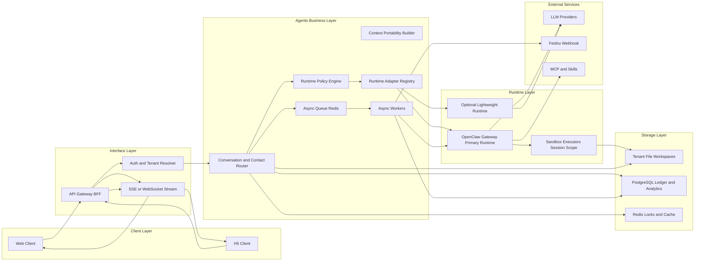

# FriendsAI Agent First 架构

## 1. Problem and Goal

FriendsAI 正在将传统人脉管理产品重做为 **agent-first 系统**。  
产品需要支持长期运行的“每用户一个管家”体验，同时保持可运维、可扩展。

核心目标：

- 保持共享控制平面，控制成本与运维复杂度。
- 保持用户数据、记忆和执行上下文的强隔离。
- 保持 agent 运行时可切换，便于后续演进。

## 2. Role Model (User / Contact / Butler)

FriendsAI 使用三个核心角色：

- **User**：FriendsAI 使用者，也是数据所有者。
- **Contact**：用户的人脉对象，仅归属于该用户。
- **Butler**：绑定到该用户的管家 Agent，持续维护关系上下文。

运行时映射：

- `user` 映射租户边界。
- `contact` 映射长期会话 channel。
- `butler` 映射由策略选择的 agent 运行时上下文。

## 3. Layered Architecture (Storage / Agents / Interface / Clients)

FriendsAI 采用四层架构并配套基础设施：

- **Storage Layer**：租户文件系统 + 系统数据库。
- **Agents Business Layer**：路由、策略、编排与异步任务。
- **Interface Layer**：对外 API 与事件流。
- **Client Layer**：Web 与 H5 客户端。

## 4. Shared vs Isolated Boundary

该系统采用“共享控制面 + 租户隔离状态”的混合形态。

| 组件                    | 共享或隔离         | 说明                                          |
| ----------------------- | ------------------ | --------------------------------------------- |
| API BFF 与 Router       | 共享               | 单一控制平面负责入口与策略                    |
| OpenClaw gateway 进程   | 共享               | 一个 gateway 可以服务多个 agent 与 channel    |
| PostgreSQL 实例         | 物理共享，逻辑隔离 | 所有租户表必须包含 `tenant_id`                |
| Redis 实例              | 物理共享，逻辑隔离 | key 与队列按 tenant 命名空间隔离              |
| Agent 身份（`agentId`） | 隔离               | 一位用户对应一个专属 `agentId`                |
| Workspace 与 agentDir   | 隔离               | 每个 agent 的文件、认证配置、模型覆盖配置     |
| Session 存储与会话记录  | 隔离               | 每个 agent 独立 `sessions.json` 与 JSONL 历史 |
| Memory 索引             | 隔离               | 默认每个 agent 独立 sqlite                    |
| Sandbox 执行器          | 隔离               | 以 session 或 tenant 作用域执行               |

## 5. OpenClaw Deployment Pattern (1 Gateway for N users)

当前阶段建议部署模式：

- **一个共享 OpenClaw gateway** 服务 N 个用户。
- **每个用户一个隔离 agent 上下文**。
- **严格路由解析**：`tenantId + contactId` 唯一映射到会话键。

必需的会话隔离配置：

- 多用户模式启用 `session.dmScope: "per-account-channel-peer"`。
- 避免使用默认 `main` scope 承载公开或多用户 DM 场景。

## 6. Runtime Switching Strategy (OpenClaw primary + optional lightweight runtime)

OpenClaw 作为主运行时，轻量运行时作为可选补充，并由策略层控制。

运行时策略：

- 聊天编排默认走 OpenClaw。
- 异步抽取与低成本批任务可切到轻量运行时。
- 运行时切换粒度为“请求级”，但受事务安全约束。

硬约束：

- 工具事务未完成时禁止切换运行时。
- 在短会话窗口内优先保持运行时粘性。
- 切换时必须传递标准化 portability context bundle。

## 7. Data Ownership and Persistence Map

### 租户文件路径映射

| 路径                                                       | 作用域                 | 所有者 |
| ---------------------------------------------------------- | ---------------------- | ------ |
| `/workspaces/{tenantId}/contacts/{contactId}/thread.jsonl` | 联系人会话日志         | 租户   |
| `/workspaces/{tenantId}/contacts/{contactId}/profile.json` | 联系人资料快照         | 租户   |
| `/workspaces/{tenantId}/memory/`                           | 长期记忆 markdown 文件 | 租户   |
| `/workspaces/{tenantId}/files/`                            | 附件与原始载荷         | 租户   |

### OpenClaw 默认路径归属映射

| 路径                                                            | 租户隔离或共享 | 说明                                |
| --------------------------------------------------------------- | -------------- | ----------------------------------- |
| `~/.openclaw/openclaw.json`                                     | 共享           | 全局 gateway 配置（除非拆 profile） |
| `~/.openclaw/agents/<agentId>/agent/auth-profiles.json`         | 租户隔离       | 每个 agent 的认证配置存储           |
| `~/.openclaw/agents/<agentId>/agent/models.json`                | 租户隔离       | 每个 agent 的模型覆盖配置           |
| `~/.openclaw/agents/<agentId>/sessions/sessions.json`           | 租户隔离       | 会话元数据                          |
| `~/.openclaw/agents/<agentId>/sessions/*.jsonl`                 | 租户隔离       | 会话文本记录                        |
| `~/.openclaw/memory/<agentId>.sqlite`                           | 租户隔离       | 默认记忆索引                        |
| `~/.openclaw/credentials/`                                      | 共享           | 渠道凭据与 allowlist                |
| `~/.openclaw/extensions/`                                       | 共享           | 已安装插件                          |
| `~/.openclaw/skills/`                                           | 共享           | 共享 skills                         |
| `~/.openclaw/logs/gateway.log`                                  | 共享           | 网关服务日志                        |
| `~/.openclaw/cron/jobs.json` 与 `~/.openclaw/cron/runs/*.jsonl` | 共享           | 定时任务调度状态                    |

## 8. Request and Event Flow (sync chat + async tasks)

### 同步聊天流

1. 客户端发送用户消息。
2. 接口层解析 tenant 与 contact 上下文。
3. Router 选择运行时与会话键。
4. 运行时返回标准化流式事件。
5. 客户端渲染文本、工具事件与结构化卡片。

### 异步任务流

1. 客户端或策略层触发抽取/同步任务。
2. 任务进入 Redis 队列。
3. Worker 在租户作用域内执行。
4. 输出写回 FS 与 DB。
5. 完成事件回推到会话流。

## 9. Security Baseline

必须满足的安全基线：

- 所有业务 API 强制携带 tenant context。
- 工具执行强制 tenant 作用域授权。
- 非可信执行路径必须开启沙箱。
- 启用路径穿越与宿主逃逸防护。
- 插件加载使用显式 allowlist。
- 对请求、运行时、工具、webhook 建立完整审计链路。

## 10. Performance and Capacity Planning

容量模型要把“共享控制面成本”和“请求执行成本”分开评估。

关键事实：

- 共享一个 gateway 能节省基础进程开销。
- 但无法消除 LLM 与工具执行成本，这些成本随负载增长。

首期容量建议：

- 小规模生产试点起步：4 vCPU + 8 GB RAM。
- 重点监控 p95 首 token 延迟、队列深度、工具重试、冷启动频率。
- 扩容前先配置租户级限流与熔断策略。

## 11. Rollout Phases

Phase 1:

- 仅 OpenClaw 运行时。
- 租户级文件与会话隔离。
- 客户端统一事件协议。

Phase 2:

- 异步任务 Worker 与持久化事件链路。
- 指定异步任务可选轻量运行时。

Phase 3:

- 策略驱动的请求级运行时切换。
- 完整可观测、安全检查与灰度发布控制。

## 12. Risks and Non-goals

已知风险：

- 若 portability 规则不严格，运行时切换会降低确定性。
- 若插件信任策略过宽，共享插件执行会放大影响面。
- 直接改 `main` 的文档提交提高回滚压力。

当前非目标：

- 本阶段不做外部系统双向同步。
- 本阶段不做 skills 市场治理。
- 本阶段不做多地域架构。

## Related Docs

- [OpenClaw 架构](/zh-CN/concepts/architecture)
- [多智能体路由](/zh-CN/concepts/multi-agent)
- [会话模型](/zh-CN/concepts/session)
- [记忆模型](/zh-CN/concepts/memory)
- [Gateway 沙箱](/zh-CN/gateway/sandboxing)
- [Gateway 安全](/zh-CN/gateway/security)
- [多 Gateway](/zh-CN/gateway/multiple-gateways)
