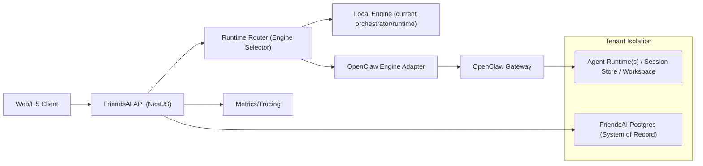

## FriendsAI → OpenClaw Agent Layer 替换方案（双栈适配器，决策版）

### 1. Summary
1. 结论：**可行**，但应分层替换，不建议一次性全量替换。  
2. 你当前项目里，`chat` 流和 `run` 能力是两条不同链路：  
   - 流式 chat：可较快接 OpenClaw。  
   - 结构化 `run`（`title_summary/contact_insight/archive_brief/network_action`）：短期应保留本地 runtime 为主。  
3. 已锁定策略：  
   - **替换策略：适配器双栈**（OpenClaw + 现有 runtime 并存）。  
   - **数据主权：FriendsAI 数据库为主**（OpenClaw 可持久化执行态/会话态）。  

---

### 2. 当前基线（已核对代码）
1. 后端核心入口：  
   - `/Users/haoqi/OnePersonCompany/friendsAI/packages/server-nestjs/src/agent/agent.controller.ts`  
   - `POST /v1/agent/chat`（SSE/`format=vercel-ai`）  
   - `POST /v1/agent/run`（结构化 one-shot）  
2. 聊天编排与工具：  
   - `/Users/haoqi/OnePersonCompany/friendsAI/packages/server-nestjs/src/agent/agent.orchestrator.ts`  
   - `/Users/haoqi/OnePersonCompany/friendsAI/packages/server-nestjs/src/ai/tools/tool-execution.strategy.ts`  
   - `/Users/haoqi/OnePersonCompany/friendsAI/packages/server-nestjs/src/tool-confirmations/tool-confirmations.service.ts`  
3. 结构化能力执行器：  
   - `/Users/haoqi/OnePersonCompany/friendsAI/packages/server-nestjs/src/agent/runtime/agent-runtime-executor.service.ts`  
4. 前端流协议耦合点：  
   - `/Users/haoqi/OnePersonCompany/friendsAI/packages/web/src/hooks/useAgentChat.ts`  
   - `/Users/haoqi/OnePersonCompany/friendsAI/packages/web/src/lib/agent-stream/parseVercelAgentStream.ts`  
   - 依赖 `conversation.created` 与 `tool.awaiting_input` 自定义 `2:` 事件  
5. OpenClaw 侧可复用能力（已核对 docs+源码）：  
   - 多 agent 路由与隔离（workspace/agentDir/sessions）  
   - 单 Gateway 多 agent（`bindings`）  
   - WS `agent` 方法、`sessions.list`、hooks `/hooks/agent`  
   - 沙箱（`sandbox.mode/scope/workspaceAccess`）

---

### 3. 目标架构（最终形态）

---

### 4. 共享与隔离边界（部署决策）
1. 生产默认：**模式 B（按需容器）**用于 OpenClaw 执行层；FriendsAI API/DB 常驻。  
2. 本地开发可先用单 Gateway（便于联调），上线再切按需容器。  

| 模块 | 部署层 | 共享/隔离 | 说明 |
|---|---|---|---|
| FriendsAI Web/API | 应用层 | 共享 | 多用户统一服务 |
| FriendsAI Postgres | 数据层 | 逻辑隔离 | `userId`/业务表隔离，SoR |
| OpenClaw Gateway | Agent 控制层 | 可共享（开发）/可隔离（生产） | 生产按需容器优先 |
| OpenClaw agent workspace/session | Agent 状态层 | 隔离 | 按用户 agentId 分区 |
| 工具执行沙箱 | 安全层 | 隔离 | 建议 `mode=all`, `scope=agent` |

---

### 5. OpenClaw 默认文件归属表（共享 vs 租户隔离）
| 路径 | 归属 | 用途 |
|---|---|---|
| `~/.openclaw/openclaw.json` | 共享 | Gateway 全局配置 |
| `~/.openclaw/credentials/` | 共享（默认） | 渠道凭据/allowlist（需谨慎） |
| `~/.openclaw/agents/<agentId>/agent/auth-profiles.json` | 租户隔离 | 每 agent 鉴权配置 |
| `~/.openclaw/agents/<agentId>/agent/models.json` | 租户隔离 | 每 agent 模型覆盖 |
| `~/.openclaw/agents/<agentId>/sessions/sessions.json` | 租户隔离 | 会话索引 |
| `~/.openclaw/agents/<agentId>/sessions/*.jsonl` | 租户隔离 | 会话 transcript |
| `<workspace>/`（每 agent） | 租户隔离 | 记忆/技能/提示文件 |
| `~/.openclaw/logs/*` | 共享 | 网关日志 |
| `~/.openclaw/cron/*` | 共享 | 定时任务状态 |

---

### 6. 改造范围（decision-complete）
1. 新增 Agent 引擎抽象层（后端）  
   - 新接口：`IAgentEngine.streamChat()`、`IAgentEngine.run()`  
   - 实现：`LocalEngine`（包装现有 orchestrator/runtime）、`OpenClawEngine`（新）  
   - 路由：按 `agentId/operation/user policy` 选择引擎，失败可回退  
2. 保持对外 API 不变（优先）  
   - 继续保留 `POST /v1/agent/chat`、`POST /v1/agent/run`  
   - 前端无感切换，避免 UI 重写  
3. OpenClaw 适配细节  
   - chat 路径优先接入 OpenClaw（WS `agent` 方法，非 `/hooks/agent`）  
   - 将 OpenClaw 流事件转换为现有 `AgentStreamEvent`，再走现有 `VercelAiStreamAdapter`  
   - 保持 `conversation.created`、`tool.awaiting_input` 事件语义  
4. `run` 路径策略  
   - Phase 1：全部走 `LocalEngine`（保证结构化输出稳定）  
   - Phase 2：按 capability 灰度迁移到 OpenClaw（先 `title_summary`，后 `contact_insight`）  
   - Phase 3：仍保留 Local fallback  
5. 数据与记忆  
   - FriendsAI DB 永远为 SoR  
   - OpenClaw workspace/session 仅作执行态与短中期上下文  
   - 结构化结果统一回写 FriendsAI（联系人、行动、归档）  
6. 工具与确认流  
   - 保留现有 `tool-confirmations` 机制为唯一写操作闸门  
   - OpenClaw 早期仅启用只读工具或受控工具  
   - 飞书发送继续由 FriendsAI 侧确认后执行  
7. 多 runtime 可切换（你要求）  
   - `EngineRegistry`: `local | openclaw | nano-*`  
   - `enginePolicy`: 全局默认 + user/agent/capability 覆盖  
   - 可做 A/B 与按用户灰度

---

### 7. 关键接口/类型变更
1. 对外 API：**不破坏**（保持 `/v1/agent/chat`、`/v1/agent/run`）  
2. 新增内部接口：  
   - `AgentEngineRequest`、`AgentEngineStreamEvent`、`AgentEngineRunResult`  
   - `RuntimeRouterDecision`（命中哪个 engine、fallback 规则）  
3. 新增配置：  
   - `AGENT_ENGINE_DEFAULT=local|openclaw`  
   - `AGENT_ENGINE_FALLBACK=local`  
   - `OPENCLAW_GATEWAY_URL`、`OPENCLAW_GATEWAY_TOKEN`  
   - `OPENCLAW_AGENT_ID_PATTERN=user_{userId}`  
   - `OPENCLAW_SESSION_KEY_PATTERN=fa:conv:{conversationId}`  

---

### 8. 代码改造落点（首批）
1. 后端主改  
   - `/Users/haoqi/OnePersonCompany/friendsAI/packages/server-nestjs/src/agent/agent.controller.ts`  
   - `/Users/haoqi/OnePersonCompany/friendsAI/packages/server-nestjs/src/agent/agent.module.ts`  
   - `/Users/haoqi/OnePersonCompany/friendsAI/packages/server-nestjs/src/agent/agent.orchestrator.ts`（封装为 LocalEngine）  
   - `/Users/haoqi/OnePersonCompany/friendsAI/packages/server-nestjs/src/agent/runtime/agent-runtime-executor.service.ts`（封装为 LocalEngine.run）  
   - 新增目录建议：`.../src/agent/engines/{engine.interface.ts,local.engine.ts,openclaw.engine.ts,engine.router.ts}`  
2. 前端改动最小化  
   - 目标是不改 `useAgentChat` 与现有 `vercel-ai` 协议解析  
   - 仅在事件字段确需扩展时改：  
     `/Users/haoqi/OnePersonCompany/friendsAI/packages/web/src/lib/agent-stream/parseVercelAgentStream.ts`  
3. 观测与审计  
   - 复用现有 run metrics，增加 `engine` 维度（local/openclaw）

---

### 9. 测试与验收
1. 协议兼容测试  
   - `chat?format=vercel-ai` 事件序列不变  
   - `conversation.created` 与 `tool.awaiting_input` 正常到前端  
2. 业务一致性测试  
   - 相同输入在 Local/OpenClaw 下，联系人回写结构满足 schema  
   - 工具确认流不可绕过  
3. 隔离测试  
   - 不同 `userId` 对应不同 `agentId/sessionKey`  
   - 禁止跨用户 session 读取  
4. 回退测试  
   - OpenClaw 超时/错误时自动 fallback Local  
   - 前端可继续收到完整 `agent.end`  
5. 性能基线  
   - 冷启动与热启动分别统计首 token 延迟  
   - 记录 OpenClaw 引擎命中率与失败率

---

### 10. 分阶段上线
1. Phase A（1 周）  
   - 建立 `Engine interface + Router + LocalEngine`，不改行为  
2. Phase B（1-2 周）  
   - 接入 OpenClawEngine，仅灰度 `chat`  
   - `run` 全走 Local  
3. Phase C（2 周）  
   - 灰度 `title_summary` 到 OpenClaw（保留 fallback）  
4. Phase D（后续）  
   - 评估 `contact_insight/network_action/archive_brief` 是否迁移或长期保留 Local  
   - 若要强隔离，切按需容器编排为默认生产路径

---

### 11. 风险与非目标
1. 风险  
   - OpenClaw 原生更偏会话型 agent，不是强结构化业务引擎；`run` 全迁移风险高  
   - 工具权限和多租户隔离配置错误会造成数据泄露风险  
2. 非目标（本轮）  
   - 不重写前端聊天框架  
   - 不替换 FriendsAI 数据模型与业务主库  
   - 不一次性淘汰本地 runtime

---

### 12. Assumptions
1. FriendsAI 继续使用 Postgres 作为业务主数据源。  
2. OpenClaw 主要承载会话执行、工具编排和可扩展 skills/mcp 接入。  
3. 先做“可切换、可回退”，再做“全替换”。  
4. 生产隔离默认按需容器；本地联调可单 Gateway。  

